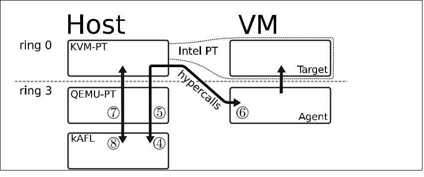
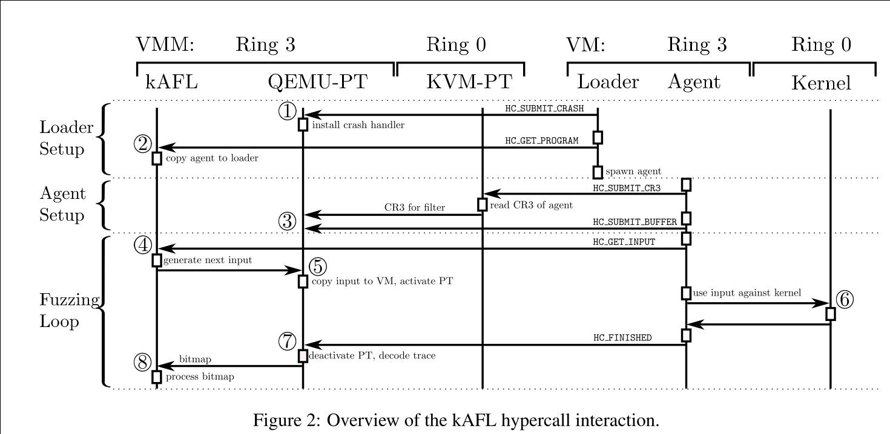

# 《kAFL: Hardware-Assisted Feedback Fuzzing for OS Kernels》阅读报告
# 1.论文概述
以往攻击者偏爱用户空间漏洞,因为用户态的漏洞通常比较稳定,方便利用,但是最近用户态的防御手段越来越完善,攻击者开始偏向于攻击内核.

而内核态下的很大一部分防御因为需要最新CPU支持或者没有得到官方支持以及性能考虑没有得到部署,这使得内核的安全变得更加重要.

以afl为代表的feedback-driven类fuzzing是一种非常有效的漏洞挖掘手段,但是之前的内核fuzzing工作都不够实用,要么需要特定的驱动或者需要反复编译内核,要么需要模拟执行而特别慢,或者fuzzing时没有feedback这种机制.

要开展内核的fuzzing有很多挑战:

- 需要保证触发了crash或者hang的时候fuzzing能继续进行而不崩溃
- 内核里不确定的行为比用户态多很多,如中断内核线程等,fuzzing的时候要避免这些影响到coverage的分析
- 内核fuzzing不能像在用户态一样直接通过命令行或者stdin进行交互
- 很多内核是闭源的,无法使用插桩这类开销小的方法

文章提出了一种结合硬件,利用英特尔CPU的PT技术的具有feedback特性的内核fuzzing方法,适用于任意的x86-64架构内核,不需要源码和spec,性能上在笔记本上可以达到一秒执行17000次.作者把这种方法实现为了kAFL,并且在github上开源.

# 2.主要内容

## 2.1.内核fuzzing的挑战

- 需要保证触发了crash或者hang的时候fuzzing能继续进行而不崩溃
- 内核里不确定的行为比用户态多很多,如中断内核线程等,fuzzing的时候要避免这些影响到coverage的分析
- 内核fuzzing不能像在用户态一样直接通过命令行或者stdin进行交互
- 很多内核是闭源的,无法使用插桩这类开销小的方法

## 2.2.两个关键

- 用Intel PT来获得路径覆盖率信息
- 用Intel VT-x来进行虚拟化,高效的执行内核
## 2.3.利用的一些特性

- Intel PT提供了执行和分支跟踪信息(执行信息和控制流信息)
- Intel PT的trace功能还可以使用一些过滤规则
  - 限制tracing的权限级别(ring0或者ring3)
  - CR3filter,只有CR3为事先指定的值的时候才trace(CR3存放当前页表指针)

### 2.3.1.tracing过滤

需要Intel PT记录的仅仅是目标vCPU的内核态进程产生的运行时信息，如果没有筛选机制，cpu会记录过多的无用信息,影响最后路径选择的判断,为此作者结合Intel PT的一些过滤特性进行过滤。

但是还有一个问题,就是内核的不确定性: 由于中断事件会随时发生,带来的不确定会影响coverage判断,因此需要消除,文章采用了两个策略:

- tracing指令时过滤中断和带来的状态转换: 中断产生的时候,忽略Intel PT的TIP和FUP数据
- 不确定性基本块黑名单: 通过反复执行测试用例,没有在每次结果中完全一致的基本块可以列入黑名单

### 2.3.2.decoder

Intel PT记录的信息是packets形式,需要编写一个decoder将packets中的条件判断分支的地址解析出来

## 2.4.系统设计

### 2.4.1.Overview

三个模块

- fuzzing逻辑: 运行在Host OS的ring3,控制fuzzing流程,包括生成测试用例,bitmap,选择测试用例等
- VM架构 (QEMU-PT + KVM-PT): **QEMU-PT可以任意访问VM的内存空间**,负责沟通其他两个模块,agent通过它获取input,fuzzing逻辑通过它获取PT trace数据
- 用户模式agent: 负责内核和input的交互,agent是各类自己编写的测试程序,比如一个挂载文件系统的程序,或者一个读取输入发起syscall的程序等等

整体架构如下图所示.

### 2.4.2.工作流程

时序图如下图:

步骤如下:

- Setup:

  - VM ring3的loader向QEMU-PT发送HC_SUBMIT_CRASH,把crash handler的地址发过去,QEMU-PT在这个地址上安装crash handler----重写了被测内核的crash处理组件,方便获取crash或hang,而不必傻等(具体实现是增加了HC_CRASH的hypercall)
  - loader请求安装agent,将agent复制到VM Ring3进行安装.
  - Agent启动后,获取自己进程的CR3地址,通过KVM-PT发送给QEMU-PT的CR3filter,保证只trace这个CR3页表下的指令
  - agent将自己获取测试用例input的buffer地址发过去

- Fuzzing loop:

  - agent发起请求获取测试用例,Fuzzing logic生成后由QEMU-PT放入buffer,打开PT的trace

  - agent用input和内核交互

  - 发起完成请求,关闭PT的trace(**频繁打开关闭是为了只trace input交互的指令**),decode trace信息

  - 更新bitmap,挑选测试用例,变异等等

### 2.4.3.Fuzzing logic
kAFL并行的运行一些固定的内容,把所有线程都用来执行most interesting的input

fuzzing logic还处理一些用户界面的内容

### 2.4.4.User Mode agent
负责内核和input的交互,agent是各类自己编写的测试程序,比如一个挂载文件系统的程序,或者一个读取输入发起syscall的程序等等, loader还要检查agent有没有crash,并进行必要的重启.

### 2.4.5.虚拟层架构

KVM-PT允许我们只trace单个的vCPU而不是logic CPU

### 2.4.6.Hypercall

通过Patch了KVM-PT来发起HC_SUBMIT_BUFFER等hypercall,另一方面patch了KVM-PT接受来自ring3的hypercall.

## 3.实验

在实验测试中，作者首先评估了kAFL在不同平台上fuzz mount虚拟磁盘这一过程的效果，发现了8个新的漏洞，另外又测试kAFL能不能发现已知CVE。最后作者编写了一个简单的json解析驱动程序，设置一定条件下的 kernel panic（内核错误），用另外一款基于qemu的内核模糊测试工具(TriforceAFL)横向比较二者性能和效果。由于kvm经过了联合pt运行的改装，作者还评估了改造带来的额外开销，验证他们的设计带来的负载影响很小。

以下简单点出测试反馈的重点：

- **三种主流OS虚拟磁盘挂载BUG挖掘**
- **windows 没有找到bug**
   - **linux 执行速度快，效果好，找到多个unique panic**
    - **macOS 发现本地拒绝服务漏洞、可以hijack rip的uaf**
  - **keyctl 驱动cve 验证**
  - **准确探测到cve**
  - **编写json parser驱动，利用triforceafl和kafl在不同操作系统和不同cpu核心的条件下测试发现分支的速度、各种性能**
  - **kAFL在效率和分支发现总量上完胜triforceafl**
  - **overhead评估**
     - **PT extention给KVM带来的overhead在百分之四以内**
     - **qemu-pt的decoder速度远胜libipt**

## 4.Discussion

1. OS独立性还不够好，loader和agent的设计模块程度不够
2. 利用intel pt 支持ring3的fuzzing
3. 针对即时编译代码的fuzzing